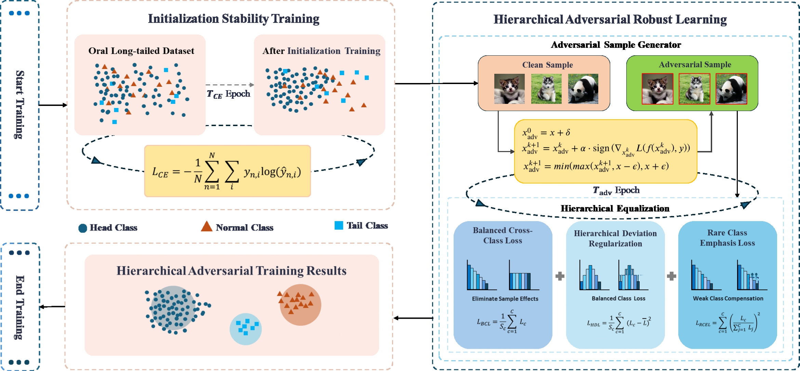
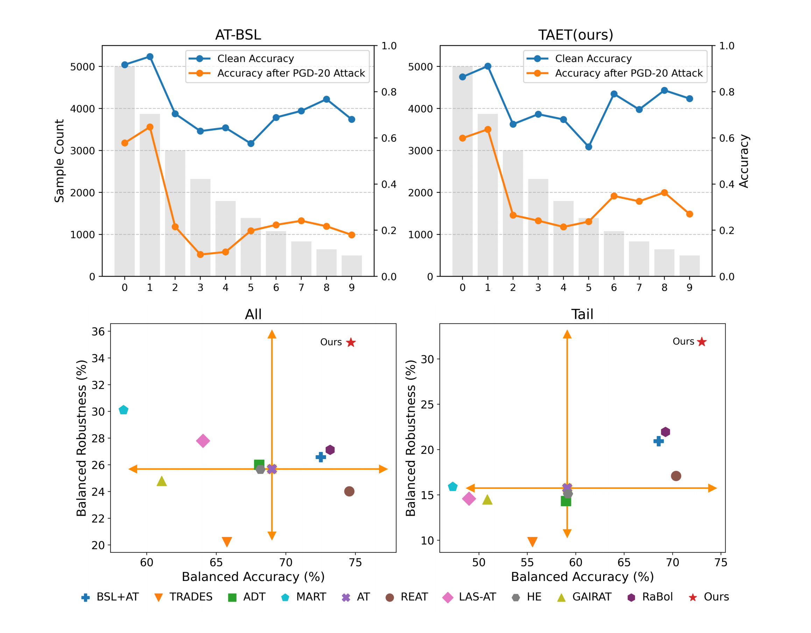
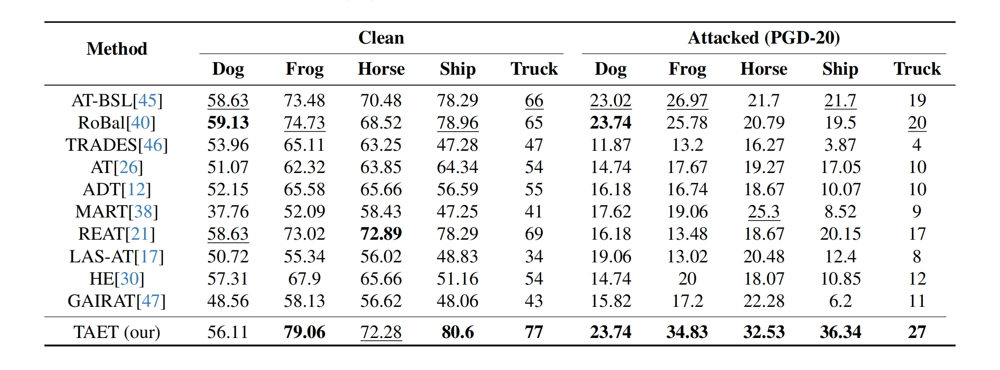

# TAET: Two-Stage Adversarial Equalization Training on Long-Tailed Distributions (CVPR 2025)
Wang Yu-Hang, Junkang Guo, Aolei Liu, Kaihao Wang, Zaitong Wu, Zhenyu Liu, Wenfei Yin, Jian Liu

## Introduction

<p align="center">
  
</p>

Adversarial robustness remains a significant challenge in deploying deep neural networks for real-world applications. While adversarial training is widely acknowledged as a promising defense strategy, most existing studies primarily focus on balanced datasets, neglecting the fact that real-world data often exhibit a long-tailed distribution, which introduces substantial challenges to robustness. In this paper, we provide an in-depth analysis of adversarial training in the context of long-tailed distributions and identify the limitations of the current state-of-the-art method, AT-BSL, in achieving robust performance under such conditions. To address these challenges, we propose a novel training framework, TAET, which incorporates an initial stabilization phase followed by a stratified, equalization adversarial training phase. Furthermore, prior work on long-tailed robustness has largely overlooked a crucial evaluation metric—balanced accuracy. To fill this gap, we introduce the concept of balanced robustness, a comprehensive metric that measures robustness specifically under long-tailed distributions. Extensive experiments demonstrate that our method outperforms existing advanced defenses, yielding significant improvements in both memory and computational efficiency. We believe this work represents a substantial step forward in tackling robustness challenges in real-world applications. 

## Directory Structure

``` text
.
├── assets/
├── code/
│   ├── AT-BSL/                 # AT-BSL method related code and files
│   ├── TAET/                   # Our method
│   ├── HARL.py                 # an implementation of Hierarchical Adversarial Robustness Loss
|   └── TAET_demo.ipynb         # a demo of our method
├── datasets/
│   ├── cifar-10-batches-py/    # Original dataset
│   ├── cifar10lt_10/           # Four datasets we created (IR of 10, 20, 50, 100)
│   ├── cifar10lt_20/
│   ├── cifar10lt_50/
│   ├── cifar10lt_100/ 
│   ├── create_cifar10-lt.ipynb # Dataset creation related code
│   └── test_cifar10lt.ipynb    # Testing dataset creation effects
```

## Data and Code Description

We base our work on the CIFAR-10 dataset, which we process using `create_cifar10-lt.ipynb` to generate long-tailed distributions with varying imbalance ratios (IR). This processing transforms the original dataset from `cifar-10-batches-py/` into four distinct long-tailed datasets:

- `cifar10lt_10/` - CIFAR-10 with IR of 10
- `cifar10lt_20/` - CIFAR-10 with IR of 20
- `cifar10lt_50/` - CIFAR-10 with IR of 50
- `cifar10lt_100/` - CIFAR-10 with IR of 100

Our codebase is organized into two main parts:
1. `code/AT-BSL/` - Contains the implementation of the baseline AT-BSL method
2. `code/TAET/` - Contains our proposed TAET method implementation

By default, our example code uses the `cifar10lt_10` dataset (IR of 10). You can modify the dataset path to evaluate performance on other imbalance ratios.

Additionally, we provide a standalone implementation of Hierarchical Adversarial Robustness Loss in `HARL.py` and include a simple demonstration of our TAET method in `TAET_demo.ipynb`.

## Dependencies and Installation

- Python 3.8+
- PyTorch
- CUDA
- torchvision
- tqdm
- NumPy
- scikit-learn
- AutoAttack
- AdverTorch

## Qualitative Results

<p align="center">
  
</p>
<p align="center">
  
</p>

## Acknowledgements

Our code implementation is based on the repositories from [AT-BSL](https://github.com/NISPLab/AT-BSL) and [TRADES](https://github.com/yaodongyu/TRADES). We sincerely thank the authors for making their code publicly available.

## Contact

If you have any question, please email `wangyuhang@mail.hfut.edu.cn`.

## Citation

If you find our work useful, please consider citing our paper:
```
@misc{yuhang2025taettwostageadversarialequalization,
      title={TAET: Two-Stage Adversarial Equalization Training on Long-Tailed Distributions}, 
      author={Wang YuHang and Junkang Guo and Aolei Liu and Kaihao Wang and Zaitong Wu and Zhenyu Liu and Wenfei Yin and Jian Liu},
      year={2025},
      eprint={2503.01924},
      archivePrefix={arXiv},
      primaryClass={cs.LG},
      url={https://arxiv.org/abs/2503.01924}, 
}
```
